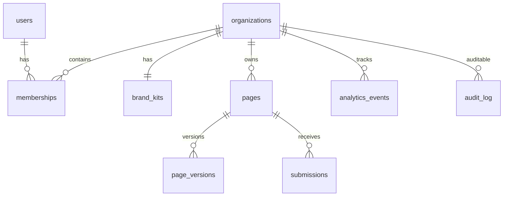

# Database architecture — Forge

See also: [MULTI_TENANCY.md](./MULTI_TENANCY.md), [PARTITIONING.md](./PARTITIONING.md), [docs/runbooks/DATABASE_ROLES.md](../runbooks/DATABASE_ROLES.md).

## Entity overview

## Row-Level Security (RLS)

- **Defense in depth:** FastAPI still filters by organization; PostgreSQL policies block accidental cross-tenant reads/writes if a query omits a `WHERE` clause.
- **Tenant tables** use `organization_id` with policies `forge_tenant_isolation` (`app.current_tenant_id`) from the initial migration; BI-01 adds `public.current_org_id()` / `public.current_user_id()` and **`organizations`** self-policy: visible row `id = current_org_id()`.
- **`users`** and global **`templates`** are not tenant-scoped with `organization_id` RLS in the same way; user resolution uses the memberships policies (see migration `c4f8a1b92e3d`).

## Partitioning

`submissions` and `analytics_events` are native `PARTITION BY RANGE (created_at)` tables registered with **pg_partman** (`migration w03_bi01_partman`): monthly child partitions, premake ahead of time, 90-day retention on analytics via `part_config`. Local Docker uses `ghcr.io/dbsystel/postgresql-partman:16` (see `docker-compose.yml`). Details: [PARTITIONING.md](./PARTITIONING.md).

## Migrations

- Alembic revision chain under `apps/api/alembic/versions/`.
- CI runs `alembic upgrade head` then a **downgrade base / upgrade head** round-trip (see `.github/workflows/ci.yml`).
- BI-01 migration adds `audit_log`, SQL helpers, `organizations` RLS, optional `forge_owner` / `forge_admin` roles.

## Adding a new tenant-scoped table

1. Add Alembic migration: table definition + FK to `organizations(id)` where applicable.  
2. `ALTER TABLE … ENABLE ROW LEVEL SECURITY` and `FORCE ROW LEVEL SECURITY`.  
3. `CREATE POLICY … FOR ALL USING/WITH CHECK` on `organization_id = current_org_id()` (or reuse `forge_tenant_isolation` pattern with `current_tenant_id`).  
4. `GRANT` appropriate privileges to `forge_app`.  
5. Add the table to the RLS regression check (`scripts/check-rls.py` and `tests/test_schema.py` — tables with `organization_id`, excluding partition children and pg_partman `template_public_%` templates).  
6. Register the SQLAlchemy model in `apps/api/app/db/models/` and import it in `apps/api/app/db/models/__init__.py` for autogenerate metadata.
