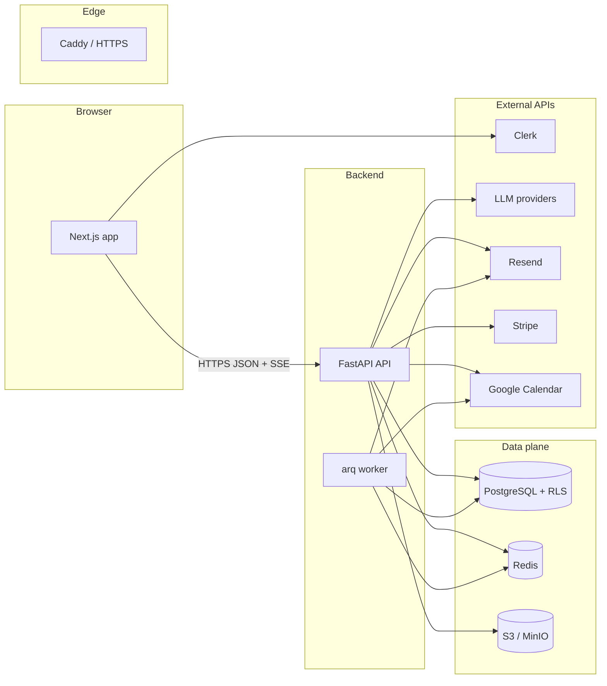

# Forge — system overview

End-state architecture for the Forge monorepo (see [PRD](../plan/02_PRD.md)).

**Request path (authenticated):** Browser → Next.js → FastAPI `/api/v1/*` with `Authorization: Bearer` (Clerk JWT) and `x-forge-active-org-id` → tenant middleware sets `app.current_tenant_id` → RLS-scoped queries.

**Request path (public page):** Published HTML served from API public runtime → tracker `POST /p/{org}/{page}/track` → `analytics_events`; form `POST /p/{org}/{page}/submit` → `submissions` + automation job enqueue.

**Background:** Worker consumes arq jobs (automations, partition maintenance, etc.) from Redis.
