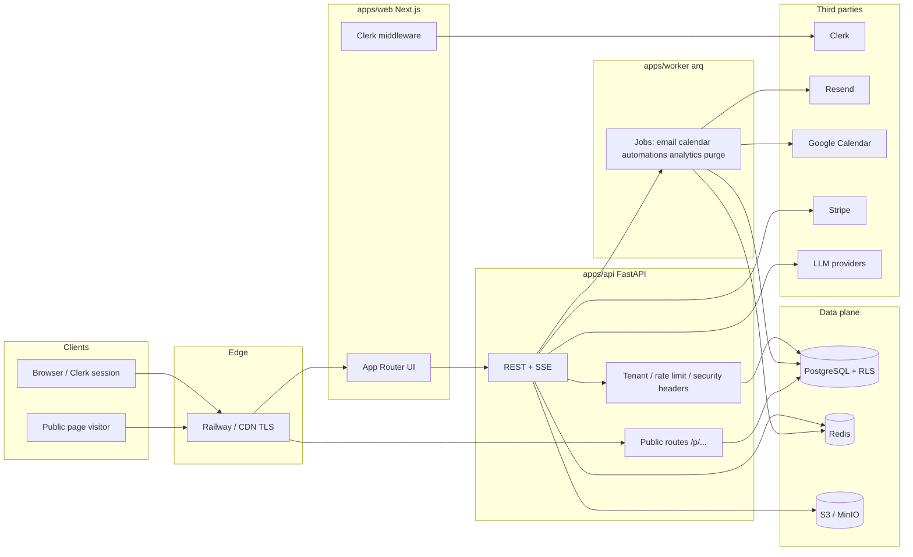

# System overview

End-to-end view of Forge for operators and new engineers. For stack versions see `docs/architecture/STACK_VERSIONS.md`.

## High-level diagram

## Request paths (summary)

| Path | Flow |
|------|------|
| **Studio generate** | Browser → `POST /api/v1/studio/generate` (SSE) → orchestration (intent → compose → validate) → persist page → stream chunks |
| **Public submit** | Visitor → `POST /p/{org}/{page}/submit` → validate schema → `Submission` row → enqueue automation job → 200 |
| **Authenticated CRUD** | Bearer JWT or API token → `require_user` + `require_tenant` → RLS session GUC → queries scoped by `organization_id` |
| **Analytics beacon** | Visitor → `POST /p/.../track` → batch insert `analytics_events` (async ingestion) |

## Data isolation

- **RLS:** `current_setting('app.current_tenant_id')` set per request for tenant tables.
- **Public routes:** No user JWT; org resolved by slug + live page; rate limits and quotas apply.

## Background work

- **arq** workers consume Redis; jobs include automations, email, calendar, partition maintenance, analytics purge.

## Observability

- **Sentry:** API + web (configure DSN in env).
- **Prometheus:** `GET /metrics` with `METRICS_TOKEN` in production.
- **Structured logs:** API uses configured logging; avoid raw secrets in messages.
